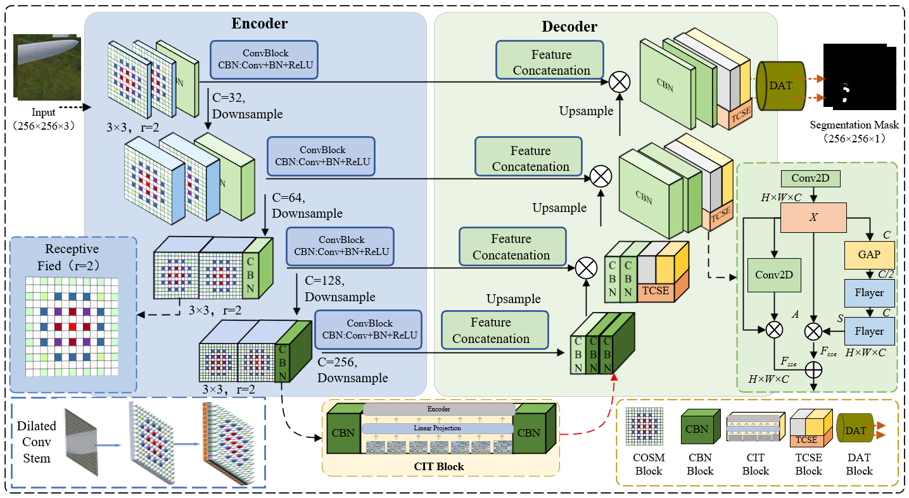
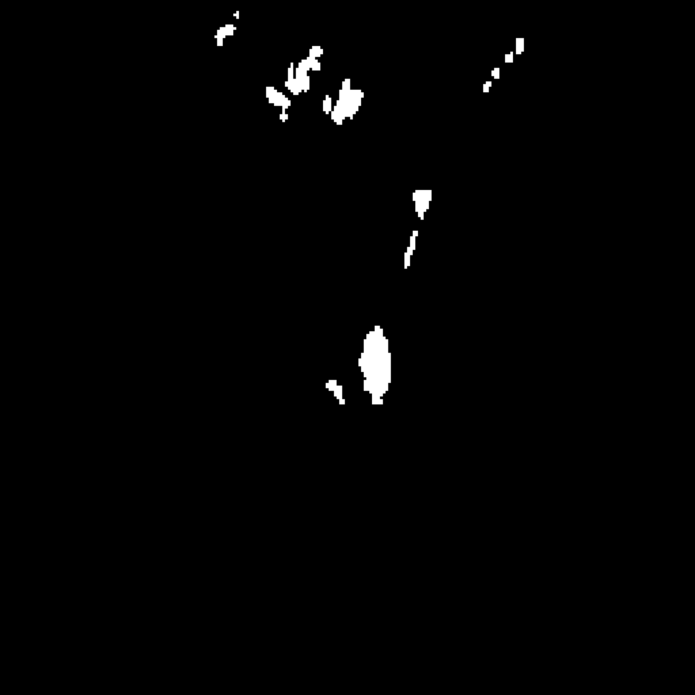
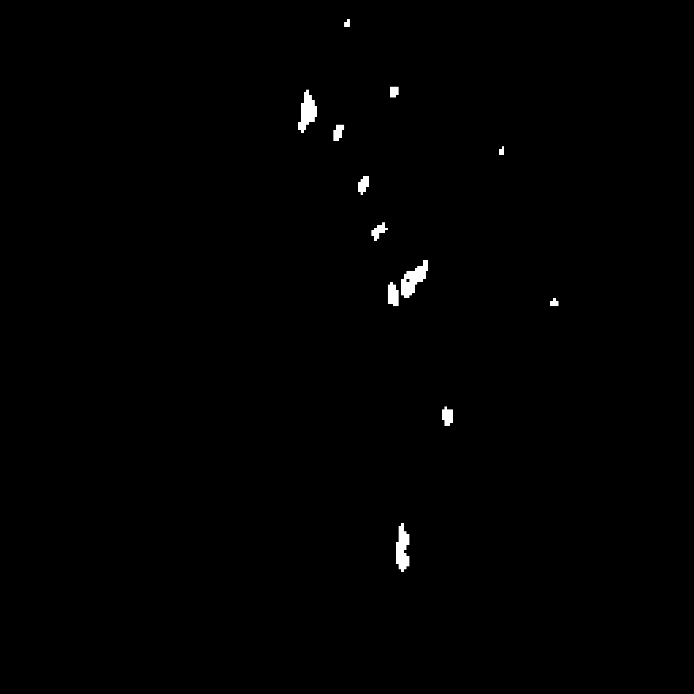
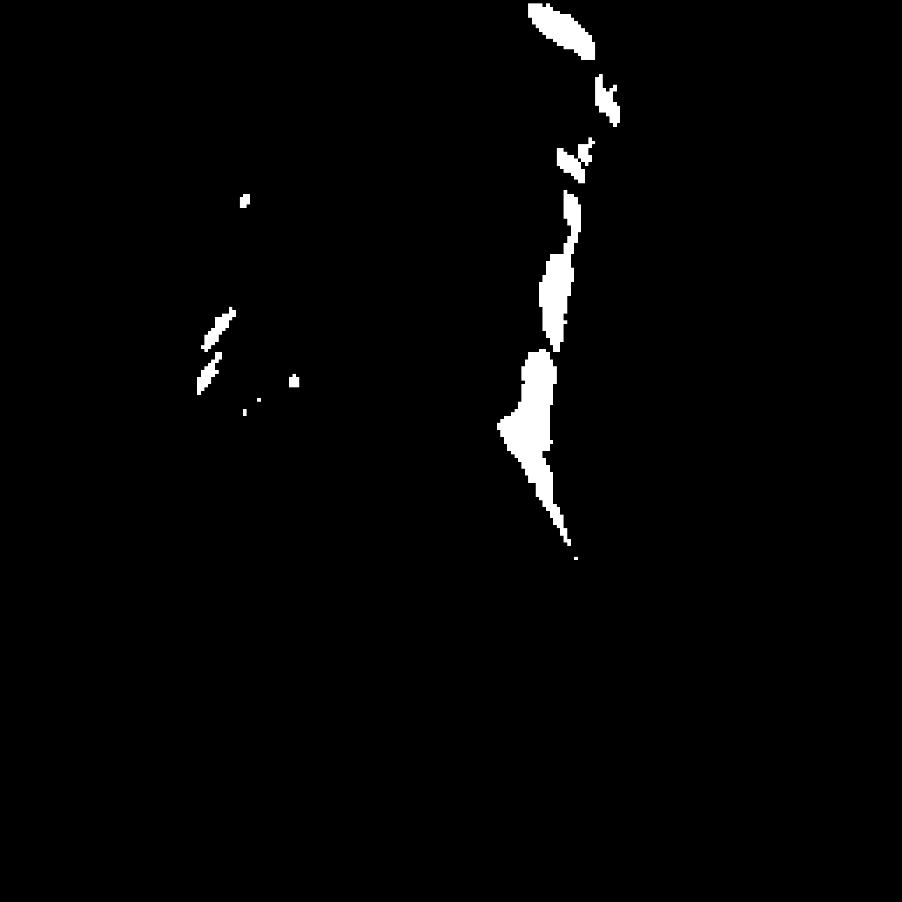
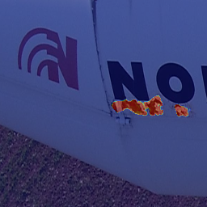
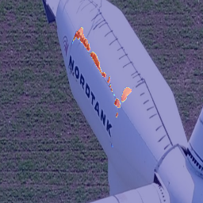
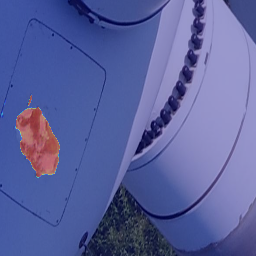

# CHS-Net

> **CHS-Net: A Deep Learning Framework for Accurate Segmentation of Complex Wind Turbine Blade Defects in UAV Imagery**

<p align="center">
  
</p>

<p align="center">
  <b>Pixel-level segmentation of complex wind turbine blade defects from UAV imagery</b><br>
  Designed for challenging scenarios with irregular morphology, complex backgrounds, and blurred boundaries.
</p>

---

## 📌 Overview

**CHS-Net** is a deep learning framework for **automatic wind turbine blade defect segmentation** in UAV-captured images.  
It is designed to address several practical challenges in real-world blade inspection, including:

- **Multi-scale defect patterns**
- **Irregular defect morphology**
- **Complex and cluttered backgrounds**
- **Blurred or ambiguous defect boundaries**

Compared with conventional segmentation networks, CHS-Net aims to provide **more accurate, robust, and fine-grained defect localization**, making it suitable for intelligent structural health monitoring and UAV-based inspection systems.

---

## ✨ Key Features

- **Accurate defect segmentation** for complex wind turbine blade surface damage
- **UAV-oriented visual analysis** under real inspection conditions
- **Modular architecture** for easy extension and ablation studies
- **Supports training / inference / visualization / heatmap analysis**
- **Research-friendly repository structure** for reproducible experiments

---

## 🧠 Method Overview

CHS-Net is built upon an encoder–decoder segmentation framework and integrates several task-oriented modules for enhanced defect understanding:

---

## 🖼️ Visual Results

### 1. Qualitative Segmentation Results

> Replace the placeholder images below with your actual visualization results from the `results/` folder.

<p align="center">
  
  
  
</p>

<p align="center">
  <i>Example qualitative results of CHS-Net on wind turbine blade defect segmentation.</i>
</p>

---

### 2. Heatmap / Attention Visualization

> Replace the placeholder images below with your actual feature response or attention maps from the `heatmap/` folder.

<p align="center">
  
  
  
</p>

<p align="center">
  <i>Feature activation / heatmap visualizations highlighting defect-sensitive regions.</i>
</p>

---

## 📂 Repository Structure

```text
CHS-Net/
├── model/                  # Network architectures and module definitions
├── utils/                  # Utility scripts (metrics, visualization, preprocessing, etc.)
├── results/                # Qualitative results / prediction visualizations
├── heatmap/                # Heatmap or feature visualization results
├── 4-sd.ipynb              # Experiment / analysis notebook
├── UNet.ipynb              # Baseline or comparative notebook
├── README.md
└── ...                     # Other scripts and configs